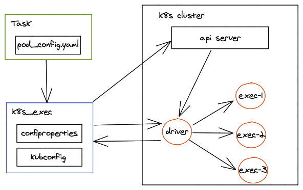

# k8s_exec

An enhanced pod exec for running tasks on Kubernetes

## Diagram

## Introduction

It is a Kubernetes task executor by adding more features to [pod_exec.py](https://github.com/kubernetes-client/python/blob/master/examples/pod_exec.py). It can manage the lifecycle of a task such as:
- Create an initial pod by task configuration
- Copy local task scripts into the initial pod
- Execute the task script and accept its standard output
- Destroy the pod when task complete, user canceling, or some error occurred

## More Features

- Auto retry on a cloud k8s service provider
- Support multiple clusters switching or even auto rebalancing
